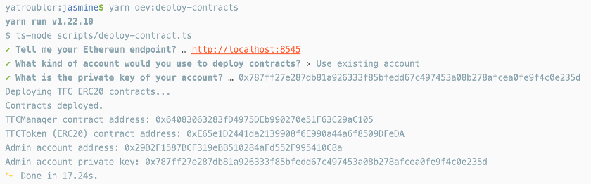

# 以太坊

参考文献：[Ethereum development documentation | ethereum.org](https://ethereum.org/zh/developers/docs/)

**以太坊**（Ethereum）是第一个引入智能合约（Smart Contract）的区块链。以太坊本身指代的是一个**协议**，而非一个链。简单来说，以太坊区块链可以分为两种：公有链（Public Chain）和私有链（Private Chain）。

- 公有链：由全世界的所有矿工共同维护的区块链，任何人都可以参与挖矿。目前以太坊公有链至少存在5条：
  - Mainnet：以太坊主链，即真正含有金融价值的ETH加密货币所在的链。
  - Ropsten：测试链，用于开发测试
  - Kovan：测试链，用于开发测试
  - Rinkeby：测试链，用于开发测试
  - Goerli：测试链，用于开发测试
- 私有链：除公有链之外其他任意创建的区块链。

典型的以太坊开发流程需要现在私有链上测试，再在公开测试链上测试一段时间，最后才部署在主链上。

**以太币**（ETH）：每一条以太坊区块链都有且只有一种原生货币（Native Currency）ETH。ETH可以在初始化区块链时分配固定的金额给固定的账户，或在挖矿中获得。

以太币的最小单位为wei：`1 ETH = 10^18 wei `。在数学运算过程中以太币的金额以**整数**（最小单位）参与计算。

**账户**（Account）：以太坊中每一个非对称加密密钥对都是一个账户，由私钥和公钥组成。账户**地址**（Address）通常为公钥的哈希值。

以太坊的账户**不需要申请**，只需要随机生成一个密钥对，即是一个账户。

**交易**（Transaction）：以太坊上的交易主要包含（但不限于）以下字段：

- from：发起交易的账户的地址。该账户需要使用私钥对交易进行签名。

- to：交易的目的地址。

- value：转账的ETH金额

- data：如果目的地址为智能合约，则data字段为智能合约的输入

- gas：交易执行过程中需要消耗gas。gas是对于交易执行需要的计算资源的度量。越是复杂的交易，消耗的gas越多。

- gasPrice：每一个gas的ETH价格。通常来说，更高的gasPrice会导致交易更快地被执行，但是手续费也更高。

  任何一个交易的执行都会自动从发起账户中扣除交易手续费。`交易手续费 = gas * gasPrice`

**交易收据**（Receipt）：交易执行之后会生成一个对应的收据，包含了交易的执行结果。

## 私有链部署（多节点集群）

## 安装
下载Go-Ethereum以太坊客户端Geth，[下载地址](https://geth.ethereum.org/downloads)。
下载解压缩后将`geth`可执行文件放在`PATH`的目录下。

检验安装：`geth version`

## 部署

### 初始化私有链（对于所有节点都相同）
创建一个私有链配置文件,`genesis.json`.
```json
{
  "config": {
    "chainId": 2020, 
    "homesteadBlock": 0,
    "eip150Block": 0,
    "eip150Hash": "0x0000000000000000000000000000000000000000000000000000000000000000",
    "eip155Block": 0,
    "eip158Block": 0,
    "byzantiumBlock": 0,
    "petersburgBlock": 0,
    "constantinopleBlock": 0,
    "istanbulBlock": 0
  },
  "nonce": "0x0",
  "timestamp": "0x59e50516",
  "extraData": "",
  "gasLimit": "0xF7270E0",
  "difficulty": "0x4000",
  "mixHash": "0x0000000000000000000000000000000000000000000000000000000000000000",
  "coinbase": "0x0000000000000000000000000000000000000000",
  "alloc": {
    "6463f93d65391a8b7c98f0fc8439efd5d38339d9": { "balance": "0x56BC75E2D63100000" },
    "ba394b1eafcbbce84939103e2f443b80111be596": { "balance": "0x56BC75E2D63100000" },
    "7fff9978b5f22f28ca37b5dfa1f9b944f0207b23": { "balance": "0x56BC75E2D63100000" },
    "0b72f31e73b47ec98a63be64eb7cf3767fcdb1b3": { "balance": "0x56BC75E2D63100000" },
    "85c76032b0ff77b54111af348fa212cc2c75470b": { "balance": "0x56BC75E2D63100000" }
  },
  "number": "0x0",
  "gasUsed": "0x0",
  "parentHash": "0x0000000000000000000000000000000000000000000000000000000000000000"
}
```
修改其中的参数来定制私有链：
- `chainId`: 私有链的id
- `difficulty`: 挖矿的难度
- `alloc`: 初始化区块链时，给相应的地址分配指定的ETH余额，以wei为单位。

`genesis.json`文件在集群中的所有节点上都必须相同。

初始化私有链：（在每一个节点上执行）
```
geth --datadir blockchain/data init genesis.json
```
`--datadir`参数指定私有链所放置的目录

### 启动私有链
在每一个节点上运行以下命令以启动以太坊节点：
```
geth --datadir blockchain/data --http --ws console
```
这一条命令会启动以太坊节点并进入Geth控制台。
启动之后，这些集群中的节点并没有链接在一起，也没有在挖矿。

确保每一个节点的`30303`和`8545`端口对外开放。`30303`端口用于以太坊P2P网络通信。`8545`端口为以太坊节点的JSON-RPC服务端口。

### 手动构建P2P连接

在每个启动的以太坊节点的Geth控制台中运行以下命令：
```
> admin.nodeInfo.enode
```
得到当前节点的enode地址：
```
enode://7ea0db40f8790867c88ec1eb037b5c36cefc3868b334d0af5c5a9a1c91515a7d1e81a7b2e17a3ab16bd1dcd94f1541874f2f0fefa863cd2b88b4001738e485e1@127.0.0.1:30303```
```
在另一个节点的Geth控制台上运行，`enodeUrl`为之前获取的enode地址，其中127.0.0.1应该替换为对应节点的公网ip。
```
> admin.addPeer(enodeUrl)
```
这一命令会手动添加一个peer到当前的以太坊节点。
查看当前节点连接的peer：
```
> admin.peers
```

### 启动挖矿

挖矿需要当前节点设置一个`coinbase`账户，即挖矿获得ETH的账户。
在以太坊节点Geth控制台中输入以下命令设置`coinbase`，`coinbaseAddress`应为coinbase账户的地址。
```
> miner.setEtherbase(coinbaseAddress)
```
查看当前`coinbase`：
```
> eth.coinbase
```
启动挖矿：
```
> miner.start()
```
停止挖矿：
```
> miner.stop()
```

# 智能合约

**智能合约**（Smart Contract）是在区块链上自动执行的程序。

- 智能合约的执行由交易触发。如果一个交易的目的地址（to）为一个智能合约，那么该交易就会触发执行该智能合约的逻辑代码。
- 智能合约的输入由交易中的data字段给出。
- 智能合约的执行没有输出。但是可以在交易收据中生成日志（log）信息。外部程序可以分析日志信息来获得智能合约的执行结果。

由于目前以太坊上的智能合约绝大多数都是以Solidity语言编写，我们在这里介绍Solidity智能合约的相关概念。

智能合约中有两种函数可以调用

- view函数：该函数的实现不允许修改区块链的状态。例如，不会修改智能合约中的变量的值，不会进行ETH转账等等。因此，调用view函数不需要发送交易，也不需要支付交易手续费。view函数一般用来查询智能合约的状态，例如变量的值，代币余额等。
- 一般函数：一般函数可以修改区块链的状态，因此调用一般函数需要发送交易并支付交易手续费。

智能合约的代码运行时可以发出（emit）事件（event），事件会以日志（log）的形式在交易收据中出现。在区块链外部的程序可以监听这些事件来获知智能合约中状态的变化。

# ERC20标准

参考文档：[EIP-20: ERC-20 Token Standard (ethereum.org)](https://eips.ethereum.org/EIPS/eip-20)

ERC20是以太坊的代币标准之一。其定义了一个包含代币交易基本操作的接口。代币是在智能合约中实现的逻辑概念，与以太坊原生货币ETH不是同一层级的概念。

在以太坊上部署实现ERC20接口的智能合约，即是发行一个新的代币（Token）。

注意ERC20代币只是智能合约中的逻辑概念。以太坊有且仅有一种原生货币——ETH。

ERC20标准包括以下函数：

**view函数**：（调用不需要发起交易）

- ```solidity
  function name() public view returns (string)
  ```

  返回ERC20代币的名字，例如TurboFil Token

- ```Solidity
  function symbol() public view returns (string)
  ```

  返回ERC20代币的标识符，例如TFC，DAI。

- ```Solidity
  function decimals() public view returns (uint8)
  ```

  返回ERC20代币的精确度。与ETH的最小单位原理相同。如果`decimals = 18`，那么一个代币等价于`10^18`个最小单位。

- ```
  function totalSupply() public view returns (uint256)
  ```

  返回ERC20代币当前的发行总额，以代币的最小单位表示。

- ```Solidity
  function balanceOf(address _owner) public view returns (uint256 balance)
  ```

  返回一个地址所拥有的ERC20代币的余额，以代币的最小单位表示。

- ```Solidity
  function allowance(address _owner, address _spender) public view returns (uint256 remaining)
  ```

  一个账户（owner）授权另外一个账户（spender）可以花费的ERC20代币的金额。如果`allowance=1`，那么spender有权从owner账户中转出一个ERC20代币的最小单位。

**一般函数**：（调用需要发起以太坊交易，并支付手续费）

- ```Solidity
  function transfer(address _to, uint256 _value) public returns (bool success)
  ```

  进行ERC20代币的转账操作，将交易发起账户中一定金额（\_value）的ERC20代币转账到另一个地址（\_to)

- ```
  function transferFrom(address _from, address _to, uint256 _value) public returns (bool success)
  ```

  进行ERC20代币的代理转账操作。交易发起者将账户（\_from）中金额为（\_value）的代币转账到另一个账户（\_to）。交易发起账户必须有足够的allowance。

- ```
  function approve(address _spender, uint256 _value) public returns (bool success)
  ```

  授权另一个账户可以转账交易发起账户中一定金额（\_value）的ERC20代币。

**事件**：

- ```Solidity
  event Transfer(address indexed _from, address indexed _to, uint256 _value)
  ```

  Transfer事件发生，当且仅当ERC20代币发生转账操作时。

- ```
  event Approval(address indexed _owner, address indexed _spender, uint256 _value)
  ```

  Approval事件发生，当且仅当approve函数被调用时。

# TFC-ERC20

TFC-ERC20是由一个实现了以太坊ERC20标准的智能合约发行的代币（Token）。

代码实现：[jasmine/TFCToken.sol at master · Troublor/jasmine (github.com)](https://github.com/Troublor/jasmine/blob/master/packages/jasmine-contracts/contracts/TFCToken.sol)

TFC-ERC20在ERC20标准规定的接口的基础上增加了额外功能。额外功能的实现基于Openzepplin[智能合约代码库]([ERC20 - OpenZeppelin Docs](https://docs.openzeppelin.com/contracts/4.x/erc20#api:presets.adoc#ERC20PresetMinterPauser))。

## 额外功能

### 代币铸造

源码：https://github.com/Troublor/jasmine/blob/master/packages/jasmine-contracts/contracts/ERC20MinterPauserBurner.sol#L55

```solidity
function mint(address to, uint256 amount) public
```

通过调用此函数，TFC-ERC20代币仅在有需要的时候铸造（mint）。只有拥有`MINTER_ROLE`权限的账户可以发起TFC-ERC20代币铸造交易，调用此函数铸造一定数量（amount）的代币给某一个地址（to）。

### 紧急暂停交易

源码：https://github.com/Troublor/jasmine/blob/master/packages/jasmine-contracts/contracts/ERC20MinterPauserBurner.sol#L69

```solidity
function pause() public
```

停用所有代币转账的功能。只有拥有`PAUSER_ROLE`权限的账户可以调用此函数。

```solidity
function unpause() public
```

恢复代币转账的功能。只有拥有`PAUSER_ROLE`权限的账户可以调用此函数。

### 代币销毁

源码：https://github.com/Troublor/jasmine/blob/master/packages/jasmine-contracts/contracts/ERC20MinterPauserBurner.sol#L97

```solidity
function burn(uint256 amount) public
```

销毁交易发起者账户中一定数量（amount）的代币。只有拥有`BURNER_ROLE`权限的账户可以调用此函数。

## 合约部署（TFC-ERC20代币发行）

### 运行环境

- node.js: `14.x`
- yarn

### 安装
```bash
git clone --recurse-submodules https://github.com/Troublor/jasmine.git
cd jasmine
yarn // 安装node.js依赖
```

### 部署合约
```bash
yarn dev:deploy-contracts
```
此脚本会要求输入以太坊接入点的URL，并且提供部署合约的管理员账户的私钥。管理员账户必须在区块链上有足够的ETH余额，以支付部署合约的交易手续费。

一个运行结果的例子如下图所示：


智能合约部署完成后会输出TFCToken合约（TFC-ERC20），以及管理员账户的地址和私钥。这些信息需要妥善保管。
